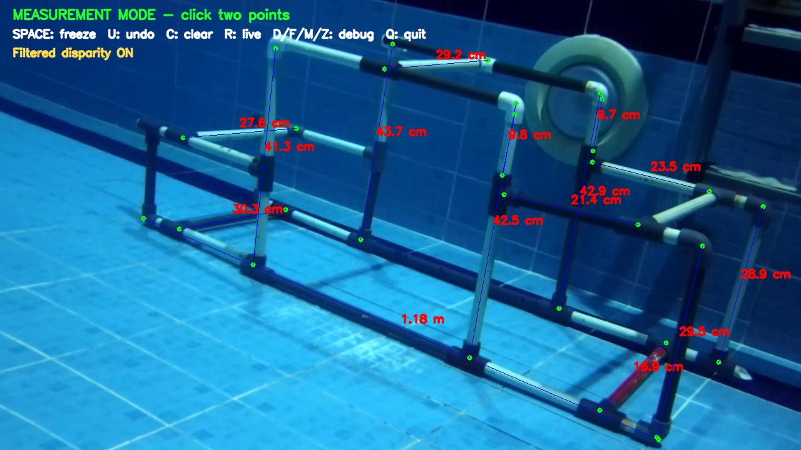
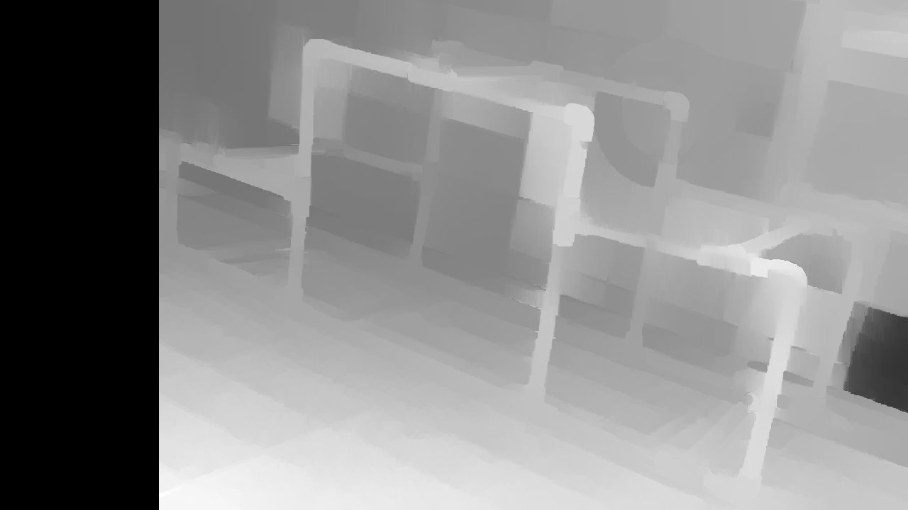
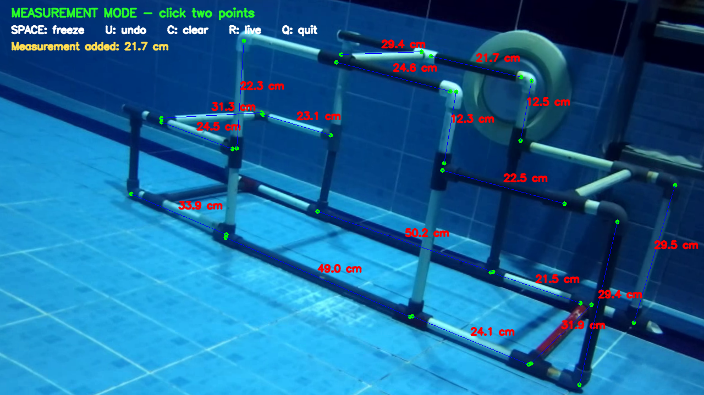
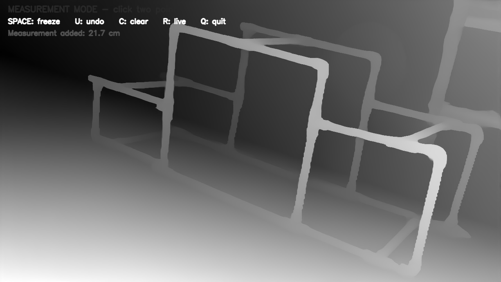
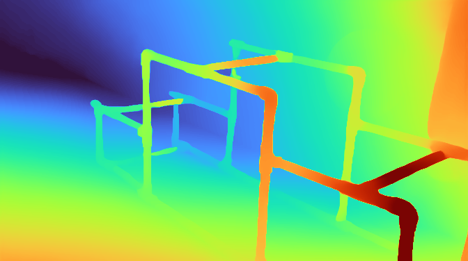

# Iceberg Depth

Stereo distance measurement tool built on top of the Stereolabs Open Capture API.

This repository publishes two supported measurement apps:

- `measure_distance_v3`: OpenCV stereo pipeline (CLAHE + SGBM + WLS + pause-to-compute workflow)
- `measure_distance_v4`: TorchScript stereo pipeline (pause-to-compute workflow)

The application supports:

- prerecorded side-by-side stereo video files (`.mp4`)
- RTSP / GStreamer stereo streams
- directly connected ZED cameras
- factory `SNxxxx.conf` calibration
- custom underwater calibration from `.npy` files
- freezing a frame and measuring the real-world distance between multiple point pairs
- interactive undo / clear / reset controls

### Example of measure_distance_v3 (SGBM)
 

### Example of measure_distance_v4 (StereoAnywhere)
  
---

## Setup

This section is the recommended repository setup for clean uploads and reproducible builds.

### 1) Install prerequisites

First make the scripts executable:

```bash
chmod +x install_prereqs.sh
chmod +x build.sh
chmod +x run_normal.sh
chmod +x run_model.sh
```

Then install all required dependencies:

```bash
./install_prereqs.sh
```

Or use the uv Python script:

```bash
sudo uv run install_prereqs.py --install-libtorch --libtorch-url <libtorch_archive_url> --install-models
```

Optional: install LibTorch automatically into `third_party/libtorch`:

```bash
uv run install_prereqs.py --install-libtorch --libtorch-url <libtorch_archive_url>
```

Optional: download model files and place them into `exports/`:

```bash
uv run install_prereqs.py --install-models
```

To overwrite existing files in `exports/`:

```bash
uv run install_prereqs.py --install-models --force-models
```

### 2) Populate the exports directory

The `exports` directory will be created automatically by the installer. You can either place your TorchScript model manually, or let the installer fetch it using `--install-models`.

Manual example:

```text
exports/stereoanywhere2_torchscript.pt
```

You can find models [here](https://drive.google.com/drive/folders/1dBQjLkgS8LAILNkJQu6Z3ObolR8X9wC1).

By default, v4 reads `exports/stereoanywhere2_torchscript.pt`.

You can override model path at runtime:

```bash
STEREOANYWHERE_MODEL_SPEC=exports/my_model.pt ./src/iceberg_depth/build/zed_open_capture_measure_distance_v4
```

or by command line argument:

```bash
./src/iceberg_depth/build/zed_open_capture_measure_distance_v4 exports/my_model.pt
```

### 3) Download LibTorch and place it in the repository

Create the lib directory in the repository root:

```bash
mkdir -p third_party
```

Download LibTorch from the official PyTorch site (CPU or CUDA package matching your machine), then extract it to:

```text
third_party/libtorch
```

Expected check path:

```text
third_party/libtorch/share/cmake/Torch/TorchConfig.cmake
```

CMake auto-detects this path. You can also override manually:

```bash
export LIBTORCH_ROOT=/absolute/path/to/libtorch
```

### 4) Optional environment overrides

These overrides apply to both v3 and v4 where relevant.

- `STEREOANYWHERE_MODEL_SPEC`: model file or config for v4
- `STEREOANYWHERE_INPUT_VIDEO`: local video path in `USE_LOCAL_VIDEO` mode
- `STEREOANYWHERE_SN_CALIB`: calibration `.conf` path in `USE_SN_CONF_CALIBRATION` mode
- `STEREOANYWHERE_GST_PIPELINE`: full GStreamer pipeline string in `USE_GSTREAMER_STREAM` mode
- `STEREOANYWHERE_UNDERWATER_CALIB_DIR`: underwater calibration directory path
- `STEREOANYWHERE_TORCH_DEVICE`: `cpu` (default) or `cuda`

---

## Build

```bash
sudo ./build.sh
```

By default this repository now builds only:

- `measure_distance_v3`
- `measure_distance_v4`

`measure_distance_v3` requires OpenCV with `ximgproc` (OpenCV contrib).

`measure_distance_v4` requires both `LibTorch` and `nlohmann_json`.

Example:

```bash
export LIBTORCH_ROOT=/opt/libtorch
sudo ./build.sh
```

If `third_party/libtorch` exists in the repository, `build.sh` and CMake will use it automatically.

You can also configure CMake directly:

```bash
cmake .. -DLIBTORCH_ROOT=/opt/libtorch -DBUILD_TORCH_EXAMPLE=ON
```

If v4 does not appear, clear the CMake cache and rebuild.

---

## Run

To run v3:

```bash
./run_normal.sh
```

To run v4:

```bash
./run_model.sh
```

---

## Source Selection

Input source and calibration source are selected in:

```text
src/iceberg_depth/examples/measure_distance_v3.cpp
```

For TorchScript v4, update the same defines in:

```text
src/iceberg_depth/examples/measure_distance_v4.cpp
```

by changing the `#define` block at the top of the file.

For v4 model path default, edit:

```text
src/iceberg_depth/examples/measure_distance_v4.cpp
```

and update `DEFAULT_MODEL_CONFIG_PATH`, or pass model path using CLI/env.

### Input Source

Enable exactly one:

```cpp
#define USE_LOCAL_VIDEO
// #define USE_GSTREAMER_STREAM
// #define USE_LIVE_ZED_CAMERA
```

or:

```cpp
// #define USE_LOCAL_VIDEO
#define USE_GSTREAMER_STREAM
// #define USE_LIVE_ZED_CAMERA
```

or:

```cpp
// #define USE_LOCAL_VIDEO
// #define USE_GSTREAMER_STREAM
#define USE_LIVE_ZED_CAMERA
```

After changing the source, rebuild:

```bash
sudo ./build.sh
```

---

## Calibration Selection

Enable exactly one:

```cpp
#define USE_SN_CONF_CALIBRATION
// #define USE_UNDERWATER_NPY_CALIBRATION
```

or:

```cpp
// #define USE_SN_CONF_CALIBRATION
#define USE_UNDERWATER_NPY_CALIBRATION
```

---

## Local Video Mode

Requirements:

- the file must contain a side-by-side stereo recording
- expected size: `2560x720`
- left image = left half
- right image = right half

---

## RTSP / GStreamer Mode

Requirements:

- the file must contain a side-by-side stereo stream
- expected size: `2560x720`
- left image = left half
- right image = right half

Then rebuild.

---

## Live ZED Camera Mode

```cpp
#define USE_LIVE_ZED_CAMERA
```

The application opens the first connected ZED camera using:

```cpp
sl_oc::video::VideoCapture
```

The camera is forced to:

```text
2560 x 720 side-by-side
```

using:

```cpp
params.res = sl_oc::video::RESOLUTION::HD720;
```

If the connected camera does not provide a `2560x720` frame, the application exits.

The application does not automatically download calibration files.
You must already have:

```text
SN31223474.conf
```

in the repository root when using `USE_SN_CONF_CALIBRATION`.

---

## Underwater Calibration

The underwater calibration files must exist in:

```text
underwater_calibration/
```

Required files:

```text
K_left.npy
K_right.npy
dist_left.npy
dist_right.npy
T.npy
left_map1.npy
left_map2.npy
right_map1.npy
right_map2.npy
```

The underwater calibration was generated for:

```text
2560 x 720 side-by-side
1280 x 720 per eye
```

Therefore the input source must match this resolution.

---

## Release Scope

This release is intentionally scoped to:

- `measure_distance_v3`
- `measure_distance_v4`

Legacy examples and tuning tools remain in source for reference but are disabled in default CMake targets.

---

## Measurement Workflow

1. Start the application
2. Wait for the live image
3. Press `SPACE` to pause and compute depth/disparity for that frame
4. Click two points
5. The points are connected and the distance is displayed
6. Repeat for additional measurements

---

## What Is Different In v3 vs v4

Both v3 and v4 use the same interaction flow (live preview, compute on `SPACE`, measurement in frozen frame).

Main differences:

- Backend:
    - v3 uses OpenCV CLAHE + StereoSGBM + WLS.
    - v4 uses TorchScript model inference.

- Dependency profile:
    - v3 depends on OpenCV (+ contrib/ximgproc).
    - v4 additionally depends on LibTorch + nlohmann_json.

- Tuning model:
    - v3 tuning is matcher/filter parameter based.
    - v4 tuning is model/export/config based.

---

## Controls

| Key | Action |
|---|---|
| `SPACE` | Pause frame and compute depth/disparity |
| Left click twice | Create a measurement |
| `U` | Undo last point or measurement |
| `C` | Clear all measurements |
| `R` | Return to live mode |
| `D` | Toggle raw disparity debug view |
| `F` | Toggle filtered disparity debug view |
| `M` | Toggle left-right validity mask debug view |
| `Z` | Toggle depth debug view |
| `Q` | Quit |

---

## Notes

- No point cloud is generated.
- Distances are computed directly from the stereo depth map.
- If the image appears zoomed when using underwater calibration, the calibration maps and input video resolution do not match.