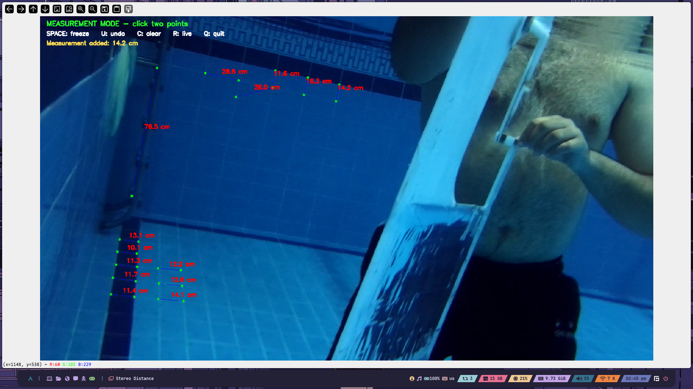
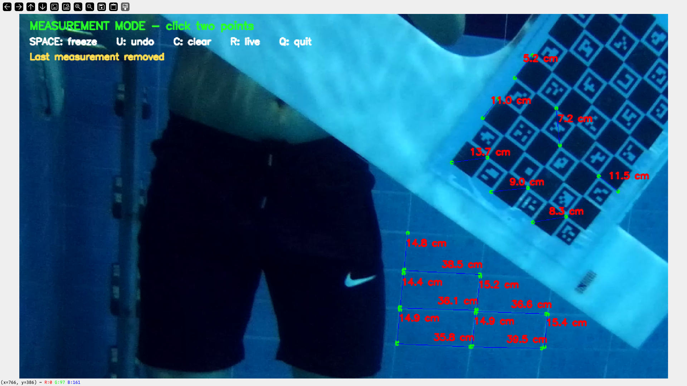
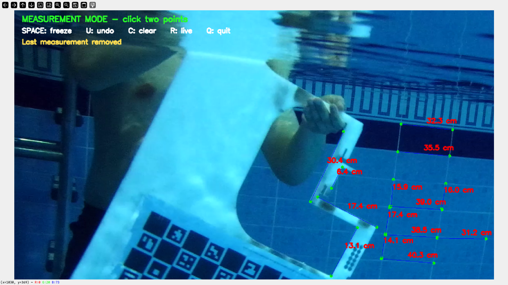

# Iceberg Depth

Stereo distance measurement tool built on top of the Stereolabs Open Capture API.

The application supports:

- prerecorded side-by-side stereo video files (`.mp4`)
- RTSP / GStreamer stereo streams
- directly connected ZED cameras
- factory `SNxxxx.conf` calibration
- custom underwater calibration from `.npy` files
- freezing a frame and measuring the real-world distance between multiple point pairs
- interactive undo / clear / reset controls

### Example with Factory Calibration:


### Example with underwater_calibration:



---

## Installation

First make the scripts executable:

```bash
chmod +x install_prereqs.sh
chmod +x build.sh
chmod +x run_receiver.sh
```

Then install all required dependencies:

```bash
./install_prereqs.sh
```

---

## Build

```bash
./build.sh
```

---

## Run

```bash
./run_receiver.sh
```

---

## Source Selection

Input source and calibration source are selected in:

```text
src/iceberg_depth/examples/measure_distance_v1.cpp
```

by changing the `#define` block at the top of the file.

### Input Source

Enable exactly one:

```cpp
#define USE_LOCAL_VIDEO
// #define USE_GSTREAMER_STREAM
// #define USE_LIVE_ZED_CAMERA
```

or:

```cpp
// #define USE_LOCAL_VIDEO
#define USE_GSTREAMER_STREAM
// #define USE_LIVE_ZED_CAMERA
```

or:

```cpp
// #define USE_LOCAL_VIDEO
// #define USE_GSTREAMER_STREAM
#define USE_LIVE_ZED_CAMERA
```

After changing the source, rebuild:

```bash
./build.sh
```

---

## Calibration Selection

Enable exactly one:

```cpp
#define USE_SN_CONF_CALIBRATION
// #define USE_UNDERWATER_NPY_CALIBRATION
```

or:

```cpp
// #define USE_SN_CONF_CALIBRATION
#define USE_UNDERWATER_NPY_CALIBRATION
```

---

## Local Video Mode

```cpp
#define USE_LOCAL_VIDEO
```

The program loads:

```cpp
const std::string localVideoPath = "recording.mp4";
```

Requirements:

- the file must exist in the repository root
- the file must contain a side-by-side stereo recording
- expected size: `2560x720`
- left image = left half
- right image = right half

---

## RTSP / GStreamer Mode

```cpp
#define USE_GSTREAMER_STREAM
```

Edit the pipeline in `measure_distance_v1.cpp`:

```cpp
const std::string gstPipeline =
    "rtspsrc location=rtsp://<ip>:<port>/videofeed latency=0 "
    "! decodebin ! videoconvert ! appsink";
```

Then rebuild.

---

## Live ZED Camera Mode

```cpp
#define USE_LIVE_ZED_CAMERA
```

The application opens the first connected ZED camera using:

```cpp
sl_oc::video::VideoCapture
```

The camera is forced to:

```text
2560 x 720 side-by-side
```

using:

```cpp
params.res = sl_oc::video::RESOLUTION::HD720;
```

If the connected camera does not provide a `2560x720` frame, the application exits.

The application does not automatically download calibration files.
You must already have:

```text
SN31223474.conf
```

in the repository root when using `USE_SN_CONF_CALIBRATION`.

---

## Underwater Calibration

The underwater calibration files must exist in:

```text
underwater_calibration/
```

Required files:

```text
K_left.npy
K_right.npy
dist_left.npy
dist_right.npy
T.npy
left_map1.npy
left_map2.npy
right_map1.npy
right_map2.npy
```

The underwater calibration was generated for:

```text
2560 x 720 side-by-side
1280 x 720 per eye
```

Therefore the input source must match this resolution.

---

## Stereo Parameter Tuning

The repository includes a StereoSGBM tuning tool:

```text
src/iceberg_depth/examples/tools/zed_oc_tune_stereo_sgbm.cpp
```

After building:

```bash
cd src/iceberg_depth/build
./zed_open_capture_depth_tune_stereo
```

The saved tuning file is automatically reused by the measurement application. The parameter file is usually stored in:

```text
~/zed/settings/zed_oc_stereo.yaml
```

---

## Measurement Workflow

1. Start the application
2. Wait for the live image
3. Press `SPACE`
4. Click two points
5. The points are connected and the distance is displayed
6. Repeat for additional measurements

---

## Controls

| Key | Action |
|---|---|
| `SPACE` | Freeze current frame |
| Left click twice | Create a measurement |
| `U` | Undo last point or measurement |
| `C` | Clear all measurements |
| `R` | Return to live mode |
| `Q` | Quit |

---

## Notes

- No point cloud is generated.
- Distances are computed directly from the stereo depth map.
- If the image appears zoomed when using underwater calibration, the calibration maps and input video resolution do not match.